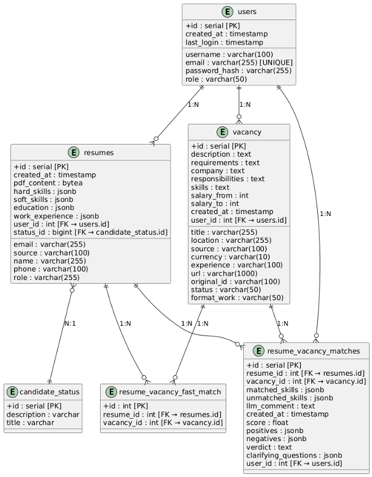

# hr-assistent

## Описание проекта

**hr-assistent** — это web-приложение, реализующее комплексный набор функций для автоматизации и оптимизации процессов подбора персонала. Система построена на микросервисной архитектуре, где каждый сервис отвечает за строго определённую функциональную область.

## Архитектура системы

Входной точкой является web-приложение с удобным пользовательским интерфейсом. Все пользовательские запросы обрабатываются единым сервисом, который взаимодействует с остальными микросервисами для выполнения необходимых операций.

### Межсервисное взаимодействие


### ER-диаграмма базы данных



## Функциональные возможности

- Регистрация новых пользователей
- Авторизация зарегистрированных пользователей
- Просмотр и фильтрация вакансий
- Импорт вакансий с внешних платформ
- Ручное создание вакансий с помощью формы
- Генерация вакансий с помощью искусственного интеллекта
- Загрузка и автоматический парсинг резюме
- Управление статусами кандидатов
- Просмотр подходящих вакансий для кандидата
- Запуск процесса сопоставления резюме-вакансий
- История сопоставлений

## Описание микросервисов

### ui-hr-partner
Веб-приложение с интуитивно понятным интерфейсом. Основные возможности: аутентификация, просмотр активности на дашборде, обработка и создание вакансий, загрузка кандидатов, визуализация соответствия кандидатов вакансиям.

### core-data-service
Входная точка для автоматизированной обработки данных. Обрабатывает все пользовательские запросы, выполняет сохранение в БД или перенаправляет запросы в другие сервисы.

### llm-integration-service
Интеграционный сервис для взаимодействия с LLM Deepseek. Выполняет генерацию вакансий, нормализацию резюме, формирование списка наиболее подходящих вакансий для кандидата.

### resume-score-service
Микросервис для сопоставления резюме и вакансий. Возвращает итоговый score, уточняющие вопросы, позитивные и негативные качества кандидата, комментарии.

### jobs-parser-service
Сервис для сбора и нормализации информации из вакансий с внешних платформ (hh, getmatch, Habr Карьера) для последующей записи в базу данных.

## Требования

- PostgreSQL
- Docker (рекомендуется для локального запуска всех сервисов)
- Node.js / Python / Java (уточните в зависимости от реализации сервисов)

## Запуск проекта

1. Клонируйте репозиторий:
   ```bash
   git clone <repo-url>
   cd hr-assistent
   ```
2. Ознакомьтесь с инструкциями по запуску каждого сервиса в соответствующих папках.
3. Запустите все сервисы с помощью Docker Compose или вручную.

## Контакты

Для вопросов и предложений: [kirya_ignatev@vk.com]
